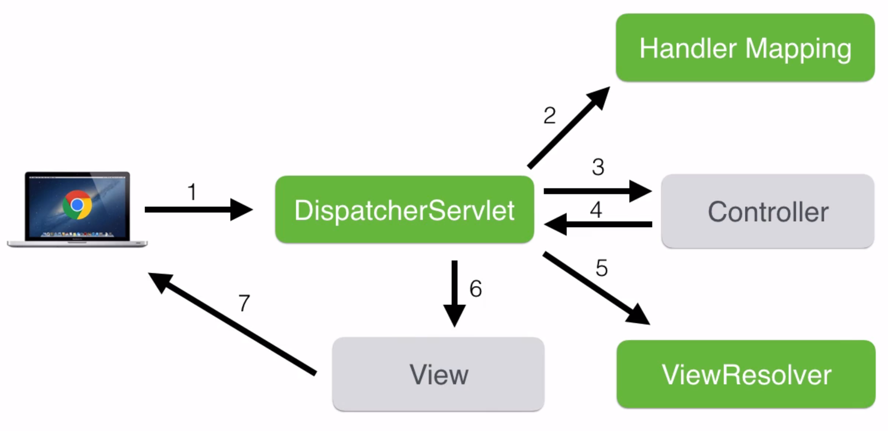

> # Projeto Spring
>  
>  ## Sobre o Spring
> 
> > -   Esse projeto não é do SpringBoot. O SpringBoot é um padrão que facilita ainda mais o desenvolvimento Web. É fácil confunfir.
> >     
> > -   Para ler a documentação do Spring, acesse o site do [Spring](https://spring.io/).
> >     
> > 
> > ## Configurações:
> > 
> > > -   IDE de uso: Eclipse.
> > >     
> > > -   JDK 11
> > >     
> > > -   Maven. Para instalar o Maven, acesse esse vídeo [aqui](https://www.youtube.com/watch?v=-ucX5w8Zm8s&t=1s)
> > >     
> > > -   [Tomcat](https://tomcat.apache.org/download-80.cgi) é onde será hospedado no projeto. 👇 
> > > > 
> > > > Baixe o zip do windows. Descompacte o arquivo, salve em algum lugar no Windows. Acesse a pasta bin, abra o CMD e execute o comando `startup.bat`. É preciso configurar uma variável de ambiente também. Para verificar todo os passos necessários, veja esse [vídeo](https://www.youtube.com/watch?v=ZQwCO1Jcq2s).  Baixe o conector do MySQL (Java MySQL connector) nesse [link](https://dev.mysql.com/downloads/connector/j/) selecionando a opção `plataform independent`. Pegue o conector MySQL, vá até a pasta do Tomcat, na pasta lib e cole o conector lá dentro. Baixe o c3po JDB data force no [link](https://sourceforge.net/projects/c3p0/files/latest/download)  Pegue o menor arquivo c3p0 (o outro arquivo de nome parecido vem com a palavra extra, ignore esse) e o arquivo mchange. Coloque esses dois arquivos dentro da lib do tomcat.
> > > 
> > > - Configurando o Tomcat dentro do Eclipse 👇
> > > 
> > > > Abra a view `server` do eclipse > escolha a pasta apache > a versão que você está usando (no meu caso a 8.5) > next e selecione o diretório (só a pasta mesmo) > next e finish. Vai aparecer uma pasta de server no Eclipse
> > > 
> > > -   Se mesmo depois de adicionar todo o pom.xml ainda aparecer um erro no projeto: 👇 
> > > 
> > > > Clique com o botão direito no projeto -> maven > `update project`.
> > > 
> > > -   O Template Engine que será usado na view é o [Thymeleaf](https://www.thymeleaf.org/). nesse [link](https://www.thymeleaf.org/download.html). Inserir no pom.xml
> > >     
> > > 
> > > Toda a configuração feita até aqui, se encontra nas seguintes classes: AppInitializer e WebConfig. O fluxo depois passa por CervejasController e depois para um arquivo HTML, cadastroCerveja. Segue imagem abaixo para mostrar o caminho que fizemos ao configurar no código.
> > > 
> > > 
> > > 
> > > -   Sobre o _**POM**_ e o _**@Valid**_  👇:
> > > 
> > > É utilizado uma _`annotation @Valid`_ que tem como objetivo validar um determinado dado. Não aceitar caracteres nulos, ou preenchidos com espaços ou até mesmo os dois. Eu estava tentando usá-lo no código mas sem sucesso. Ao executar o aplicativo um erro é mostrado no console e na página do localhost onde é evidenciado que a classe que executa o _`@Valid`_ não pode ser encontrada. Isso acontece porque o `Java` removeu o `xml` se sua biblioteca padrão a partir do `Java 9` como explica esse [link no StackOverflow](https://stackoverflow.com/questions/43574426/how-to-resolve-java-lang-noclassdeffounderror-javax-xml-bind-jaxbexception).
> > > 
> > > > -   __Como corrigir?__  Adicione o seguinte `xml` no arquivo `pom`:
> > > >     
> > > > 
> > > > <!-- API, java.xml.bind module -->  
> > > >  <dependency>  
> > > >  <groupId>jakarta.xml.bind</groupId>  
> > > >  <artifactId>jakarta.xml.bind-api</artifactId>  
> > > >  <version>2.3.2</version>  
> > > >  </dependency>  
> > > > ​  
> > > >  <!-- Runtime, com.sun.xml.bind module -->  
> > > >  <dependency>  
> > > >  <groupId>org.glassfish.jaxb</groupId>  
> > > >  <artifactId>jaxb-runtime</artifactId>  
> > > >  <version>2.3.2</version>  
> > > >  </dependency>
> > > 
> > - Instalando o plugin do thymeleaf :point_down::
> > Copie esse link: [http://www.thymeleaf.org/eclipse-plugin-update-site/](http://www.thymeleaf.org/eclipse-plugin-update-site/), vá no eclipse em `Help -> Install new software -> add -> Name: Thymeleaf Eclipse plugin -> Location:` e insira o link copiado.
